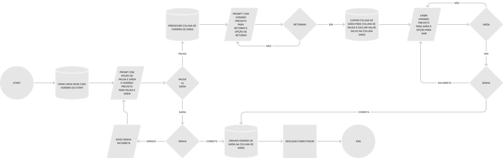

# hr_hourControl
 
 <b>Developed by: </b>Vinicius Schnoor 
 <b>Version: </b>1.0 BETA 
 <b>Release: </b>
 <h2>Description</h2>
 <h3>SCHEMA</h3>
 
 

 
To start, do you need create a virtual enviroment. At command prompt, type:

 <code>
 py -m venv venv 
 .\venv\Scripts\activate 
 py -m pip install --upgrade pip
 </code>